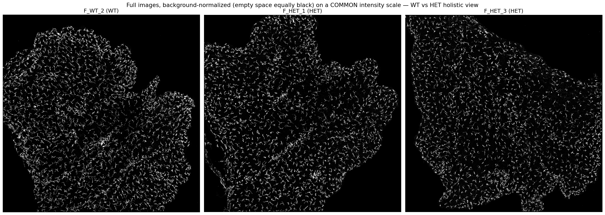
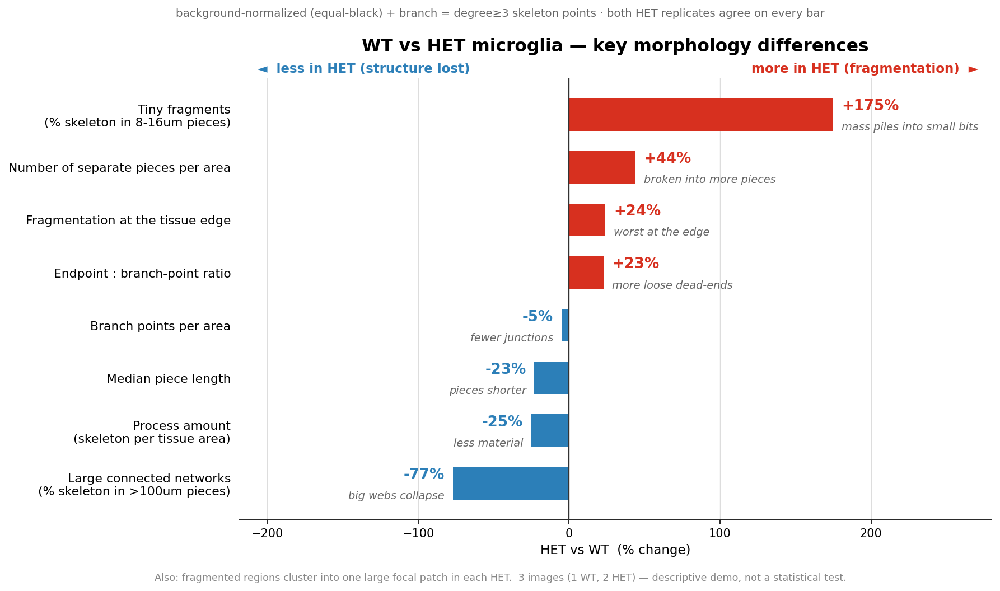
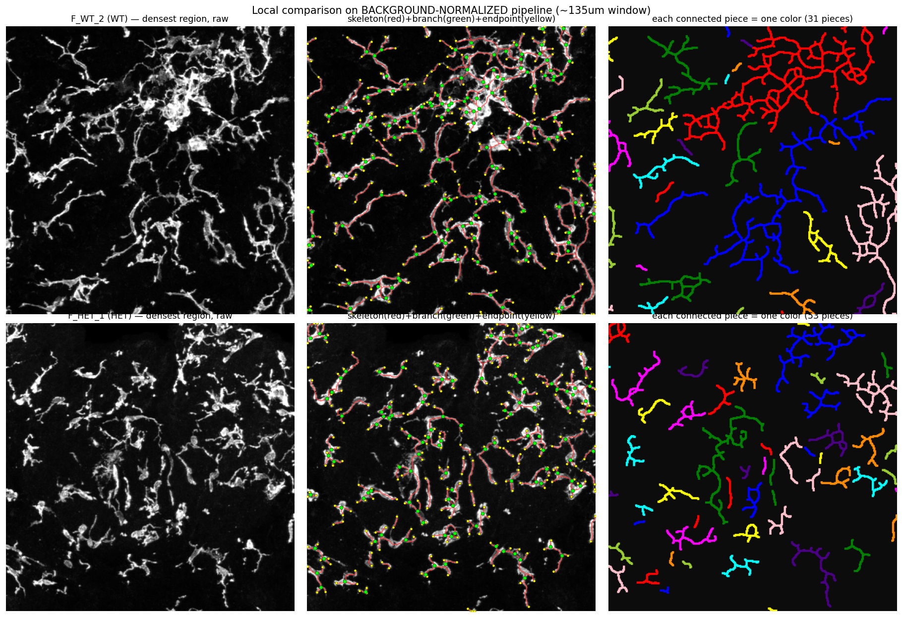
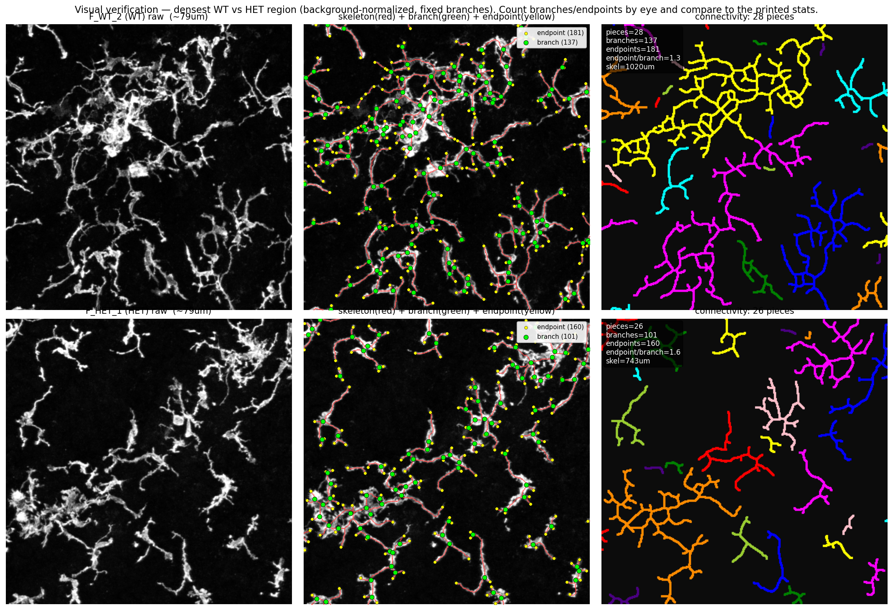
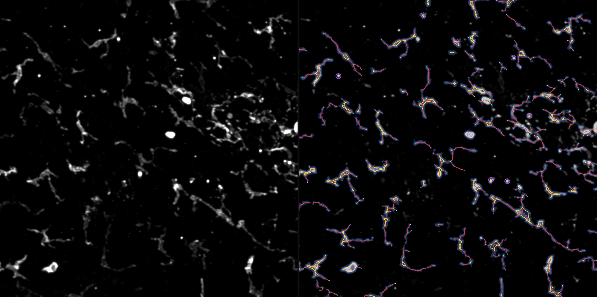
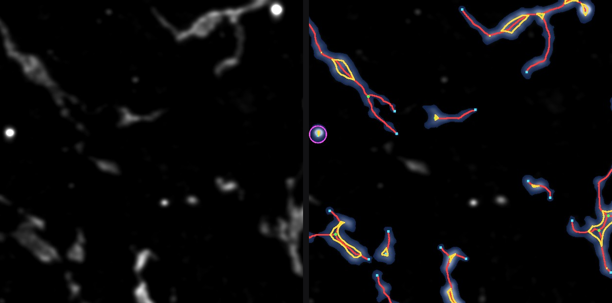
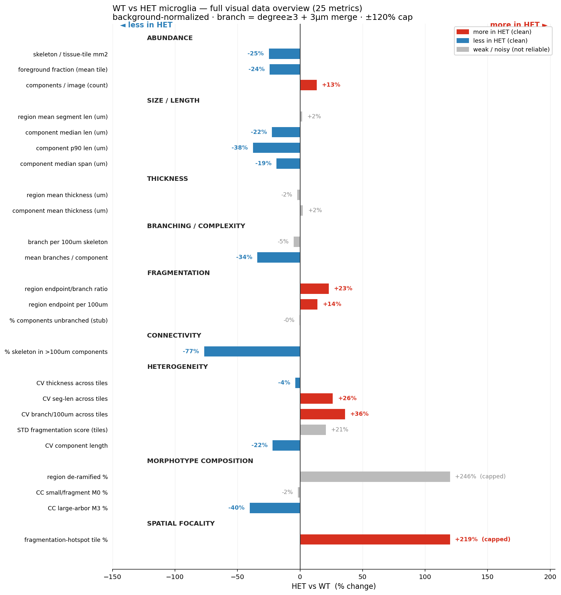

# choroid-microglia

**Quantifying microglia morphology in choroid-plexus whole-mount fluorescence
images** — a skeleton-based pipeline that measures how microglial processes
branch, connect, and fragment, and compares those features between conditions
without requiring per-cell segmentation.

Computational research in the lab of **Huixin Xu (UC Irvine, EEB)**. Two projects
live here; Project A (below) is the one with results.

---

## What this can do

These are dense, single-channel (Iba1-type) whole-mounts where microglial
processes touch and overlap, so reliable *per-cell* segmentation is not yet
possible. Instead the pipeline extracts the **process skeleton** of the whole
tissue and quantifies its **topology** — branching, connectivity, fragmentation,
and spatial heterogeneity — which is robust to the connect-vs-separate ambiguity
that breaks cell counting.

Demonstrated on 3 images from published Lehtinen-lab samples — **1 wild-type
(WT, control)** and **2 disease replicates (HET, an Alzheimer's model)** — the
pipeline cleanly separates the two conditions and reproduces the expected
disease signature.

### 1. It handles the whole tissue
Full-image segmentation after background normalization (empty space matched to
equally black across images, so brightness differences are not mistaken for
biology), on a common intensity scale.



### 2. It finds a consistent, replicated difference
HET microglia are **de-ramified and fragmented**: large connected networks
collapse, processes break into more and smaller pieces with more free dead-ends,
and the change is worst at the tissue edge. Every metric below agrees across
**both** HET replicates (i.e. the two disease images land on the same side of
the control, and closer to each other than to it).



### 3. The extraction is verifiable by eye
Skeleton (red), branch points (green, defined as 1-px skeleton pixels of degree
≥ 3, with nearby junctions on the same process merged within 3 µm), and endpoints
(yellow), with measured counts printed per window so the numbers can be checked
against the picture. Connectivity coloring (each connected piece a distinct
color) shows WT forming large connected webs vs HET breaking into many small
pieces.




The 2026-08 pipeline draws the same audit, per ROI. Left is the background-subtracted input, right
is the same field with the extraction on top — blue mask, red skeleton, yellow soma outline, cyan
endpoints, magenta circle on a cell classified as round. All 74 ROIs were reviewed this way.



At native resolution, one image pixel per skeleton pixel, no upsampling:



### 4. It reports many metrics at once — and is honest about which to trust
25 metrics across abundance, size, branching, fragmentation, connectivity,
heterogeneity, morphotype composition, and spatial focality. Clean
(replicate-consistent) metrics are colored; weak/noisy ones (e.g. process
thickness and segment length, where the two replicates disagree) are greyed out
and **not** claimed.



The underlying numbers are in [`docs/figures/FINAL_METRICS.csv`](docs/figures/FINAL_METRICS.csv).

---

## Method (Project A)

1. **Normalize** — per-image percentile stretch; **rolling-ball background
   subtraction** so empty space is equally black across images (removes the
   acquisition-brightness confound).
2. **Segment & skeletonize** — threshold the background-free image → 1-px
   skeleton.
3. **Clean topology** — drop tiny fragments, prune short spurs, break tree loops
   at their dimmest pixel.
4. **Extract topology** — endpoints (degree 1) and branch points (degree ≥ 3,
   merged along the skeleton within 3 µm), connected components, per-segment
   length/type.
5. **Quantify at two units** — fixed-grid **regions** (local fingerprints +
   spatial focality) and **connected components** (object size/connectivity);
   the two units use completely different definitions yet converge on the same
   conclusion.
6. **Compare WT vs HET** with a replicate-consistency screen, plus sensitivity
   checks across segmentation methods, tile sizes, and grid placements.

**Scope / honesty.** This is an exploratory **demo on 3 images** — a descriptive,
not a statistically powered, comparison. The replicate-consistency screen
substitutes for, but does not replace, a significance test across animals. Per-cell
counts are deliberately avoided. Process **thickness** is a binary-mask width
proxy, not a true diameter.

---

## Repository layout

```
project_A_morphology/
  pipeline_2026-08/              # ← CURRENT. The 12-animal WT/Het cohort pipeline.
    server.py                    #   the engine: frozen 39-key recipe + per-ROI extraction
    index.html                   #   workbench front end (draw ROIs, inspect extraction)
    preprocess_clean_images.py   #   step 0: flat-fielded TIF - 8um rolling ball -> clean/
    rebuild_clean.py             #   standalone step 0, paths on the command line
    stats_*.py                   #   animal-median collapse, Hedges g, permutation, BH-FDR
    rois/                        #   74 hand-drawn ROI boxes - the one irreplaceable input
  data/raw/                      # drop your .tif images here (gitignored; not committed)
  experiments/                   # 2026-05/06 exploration that led to the above
    clean_topology.py            # skeleton topology: spurs, loops, branch points
    full_morphology/
      pipeline.py                # single source of truth: segment → skeleton → topology
      cache_arrays.py            # cache per-image arrays for fast multi-angle analysis
      region_morphotype.py       # region (tile) fingerprints + morphotype composition
      cc_morphotype.py           # connected-component sizes/morphotypes
      segmentation_compare.py    # robustness across 5 segmentation methods
      grid_robustness.py         # robustness across grid placements
      comprehensive_summary.py   # all metrics + verdicts → FINAL_METRICS.csv
      render_*.py / present.py   # figures
project_B_stabilization/         # Shipley-2020 z-stack stabilization (see HANDOFF.md)
docs/figures/                    # showcase figures (this README)
```

**Start in `project_A_morphology/pipeline_2026-08/`** — that is the version the reported numbers
came from, and its `README.md` has the run order, the data layout it expects, and the ways it can
silently produce wrong numbers. `experiments/` below it is the earlier exploration, kept for
provenance. Images and measured results are not in this repository.

## Setup on a new machine

The pipeline is self-contained and path-portable (every path resolves relative to
the repo, so it runs from any clone location / OS / username).

```bash
git clone https://github.com/sgaofen/choroid-microglia
cd choroid-microglia
python -m venv .venv && source .venv/bin/activate     # or conda/micromamba
pip install -r requirements.txt
```

## Running on your own images

1. Drop your `.tif` images into `project_A_morphology/data/raw/`. **Put `WT` or
   `HET` in each filename** — images are auto-discovered and grouped into the
   control (WT) vs disease (HET) groups by that token. Any number of images per
   group works; the WT-vs-HET screen aggregates over each group and flags a
   metric as **clean** only when every HET image lands on the same side of the WT
   mean and the replicates agree.
2. Run the pipeline:

```bash
cd project_A_morphology/experiments/full_morphology
python cache_arrays.py            # segment → skeleton → topology, cached per image
python region_morphotype.py       # region (tile) fingerprints + morphotypes
python cc_morphotype.py           # connected-component sizes / morphotypes
python comprehensive_summary.py   # all metrics + verdicts → out_region/FINAL_METRICS.csv
python render_table_clean.py      # key-findings figure  (out_region/stats_table.png)
python render_overview_chart.py   # full visual data overview
python present.py                 # dashboard + connectivity figures
```

Optional robustness / diagnostics: `segmentation_compare.py` (5 segmentation
methods), `grid_robustness.py` (grid placements), `merge_sweep.py` (junction-merge
tolerance), `branch_simple_diag.py` / `verify` crops (eyeball the extraction).

The branch-merge tolerance (junctions within 3 µm on the same process counted as
one) lives in `clean_topology.merged_branches`; segmentation/normalization params
live at the top of `pipeline.py`.

## Project B — `project_B_stabilization/`

Python port of the **Shipley et al. 2020** (Neuron; PMID 32961128) MATLAB
pipeline that motion-stabilizes *in vivo* z-stacks of choroid plexus (the tissue
floats freely in CSF, so slices are misaligned by large displacements and
standard motion correction fails). Original code:
[LehtinenLab/Shipley2020](https://github.com/LehtinenLab/Shipley2020).

**Done** — `project_B_stabilization/pyport/` ships two versions:

- **replicate** — the original algorithm, reproducing the reference output bit
  for bit, minus the MATLAB / Java / Fiji dependencies and the manual export
  step.
- **improved** — four corrections on top: larger usable field (black border
  9.5% -> 3.4%), sharper frames, less residual drift (0.28 -> 0.19 px), plus an
  elastic pass for the frames distorted during animal motion.

A 55-minute run (65 GB) now processes in **2.2 minutes** on a laptop, against
an estimated 1-6 hours for the original setup. See
`project_B_stabilization/pyport/README.md`; `CODEMAP.md` / `HANDOFF.md` hold
the reverse-engineering notes.

## Data

The three sample images in `project_A_morphology/data/raw/` are from
already-published Lehtinen-lab work and are safe to share. Any future raw imaging
from the lab is unpublished and confidential and is **not** included here.

## Acknowledgements

Choroid-plexus biology and sample images: Huixin Xu (UC Irvine) and the Lehtinen
lab (Boston Children's Hospital / Harvard). Shipley 2020 registration code:
Lehtinen lab.
